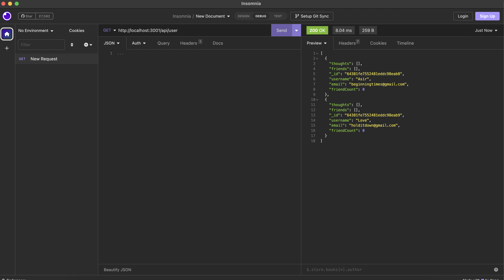

## Social Media API

## Description

In this project, this is the back end station of a social network that creates users, thoughts of the user and the friends that they have on this site. Using MongoDB and Mongoose to build up the back end, retrieving data, posting data, updating post and deleting data.

## Walkthrough Video

<link href="file:///Users/derekaraujo/Downloads/Social%20Media.webm"></link>

## Installation

Work on the repo, use NPM i to download the neccesary dependencies for it to functioning. Test software in Insomnia.

## Usage

Looking for a User

</img>

## Contact Me

derekaraujo11@gmail.com
